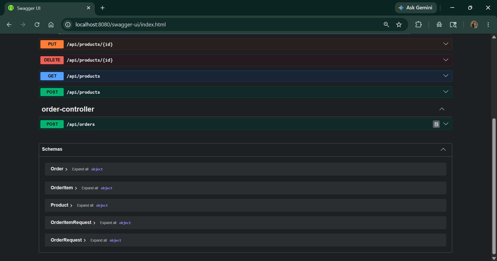
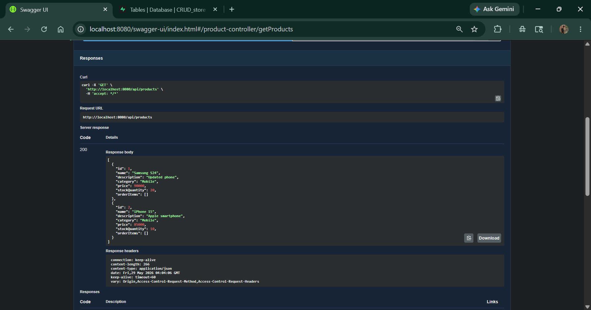
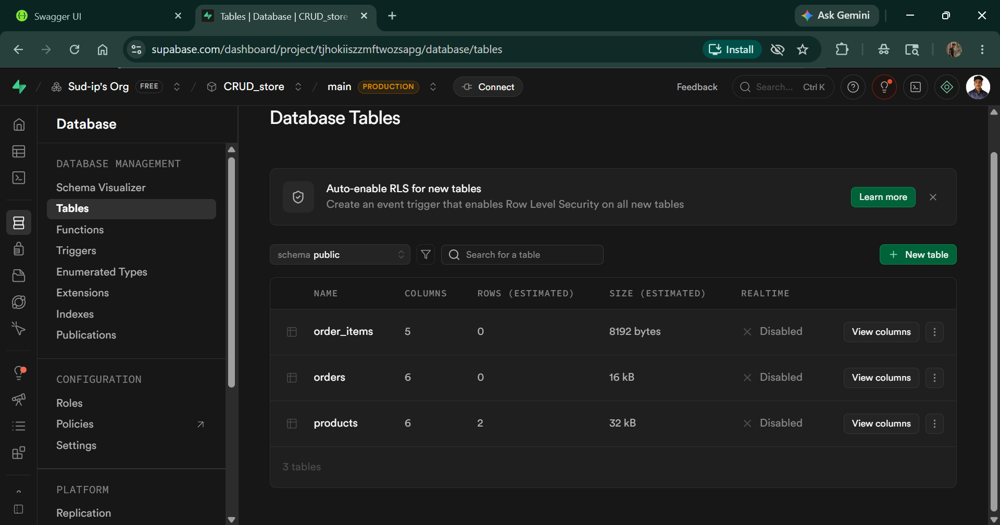

# 🛒 Spring Boot Ecommerce CRUD API

A production-style **RESTful Ecommerce CRUD API** built using **Spring Boot**, **Spring Data JPA**, **Hibernate**, and **PostgreSQL**. This project demonstrates backend development skills including API design, database integration, layered architecture, and API documentation using Swagger UI.

## 🚀 Features

✅ Create Product
✅ Get All Products
✅ Get Product By ID
✅ Update Product
✅ Delete Product
✅ REST API Architecture
✅ PostgreSQL Database Integration
✅ Swagger UI API Documentation
✅ Layered Architecture (Controller → Service → Repository)

---

## 🛠️ Tech Stack

* **Java 17**
* **Spring Boot**
* **Spring Data JPA**
* **Hibernate**
* **PostgreSQL**
* **REST API**
* **Swagger / OpenAPI**
* **Maven**
* **Git & GitHub**

---

## 📂 Project Structure

```text
src
├── main
│   ├── java/com/example/ecommerce_spring
│   │   ├── controllers
│   │   ├── services
│   │   ├── entities
│   │   ├── repositories
│   │   ├── dto
│   │   └── EcommerceSpringApplication.java
│   └── resources
│       └── application.properties
```

---

## 🔗 API Endpoints

| Method | Endpoint         | Description       |
| ------ | ---------------- | ----------------- |
| GET    | `/products`      | Get all products  |
| GET    | `/products/{id}` | Get product by ID |
| POST   | `/products`      | Add new product   |
| PUT    | `/products/{id}` | Update product    |
| DELETE | `/products/{id}` | Delete product    |

---

## 📸 API Screenshots

### Swagger UI



### Get All Products API



### Database Tables



---

## ⚙️ Installation & Setup

### Clone Repository

```bash
git clone https://github.com/Sud-ip/springboot-crud-api-store.git
```

### Navigate to Project

```bash
cd springboot-crud-api-store
```

### Configure Database

Update your database credentials in:

```text
src/main/resources/application.properties
```

### Run Project

```bash
mvn spring-boot:run
```

---

## 📖 Swagger Documentation

After running the project:

```text
http://localhost:8080/swagger-ui/index.html
```

---

## 🎯 Learning Outcomes

* Built RESTful APIs using Spring Boot
* Implemented CRUD operations with JPA & Hibernate
* Integrated PostgreSQL database
* Used layered architecture for clean code
* Documented APIs using Swagger UI
* Practiced Git & GitHub workflow

---

## 👨‍💻 Author

**Sudip Pal**

GitHub: https://github.com/Sud-ip
